Mouse bone marrow single-cell RNA-seq
-------------------------------------

This tutorial describes how to apply CellRouter to a mouse bone marrow
single-cell RNA-sequencing dataset generated by Grun et al (Cell Stem
Cell 2016). The analysis reported here reproduce the trajectory analysis
presented in the Figures 2 and 3 of our manuscript (Lummertz da Rocha et
al, Nature Communications 2018)

Load processed data
-------------------

CellRouter assumes that your are providing a gene expression matrix with
genes as rows and single-cells as columns. It also assumes that the data
is already normalized and confounding sources of variation were properly
removed.

    source('../CellRouter_Class.R')
    libdir <- '../CellRouter/'

    matrix <- get(load('results/matrix.R'))
    ndata <- get(load('results/normalized_expression.R'))
    fdata <- get(load('results/filtered_expression.R'))
    colnames(matrix) <- c('tSNE1', 'tSNE2')

Preprocessing
-------------

    ## removing chromossome names from gene names and averaging expression
    genes <- sapply(strsplit(rownames(ndata), split='__', fixed=TRUE), function(x){x[1]})
    map <- data.frame(id=rownames(ndata), symbol=genes, stringsAsFactors = FALSE)
    ndata <- averageIds(ndata, map, 'symbol')

    #Remove genes with zero variance across all cells
    var <- apply(ndata, 1, var)
    var <- var[which(var > 0)]
    ndata <- ndata[names(var),]

    ### selecting genes to use as regulated along developmental trajectories
    pca <- prcomp(t(ndata), scale=TRUE, center=TRUE)
    loadings <- pca$rotation
    num_pc <- 5
    quantile <- 0.975
    genes2use <- unique(as.vector(unlist(apply(loadings[,1:num_pc], 2, function(x){names(x[which(abs(x) >= quantile(x, quantile))])}))))

Create a CellRouter object
--------------------------

    #ggrn <- get(load('results/GRN.R'))
    ### Subpopulation identification and gene signatures with CellRouter
    cellrouter <- CellRouter(expdata=ndata, annotations=colnames(ndata))

    ## [1] "Initializing CellRouter object"

    cellrouter@rdimension <- matrix
    cellrouter <- findsubpopulations(cellrouter, 5, 'jaccard', 'results/kNN_network.gml')

    ## [1] "building k-nearest neighbors graph"
    ## [1] "discoverying subpopulation structure"
    ## [1] "plotting graph in RStudio"

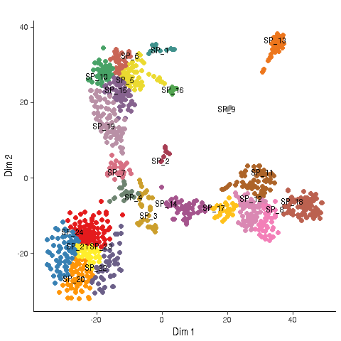

    ## [1] "done plotting graph"
    ## [1] "updating CellRouter object"

    cellrouter <- diffexpr(cellrouter, column='population', pvalue = 0.05)

    ## [1] "discovering subpopulation-specific gene signatures"

    markers <- findmarkers(cellrouter)

    ## [1] "finding subpopulation markers"

    plotReducedDimension(cellrouter, 3.5, 3.5, filename='results/tSNE.pdf')

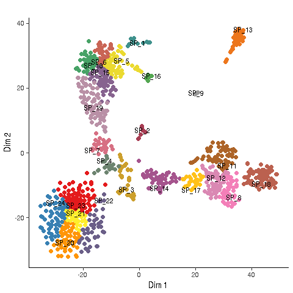

Starting trajectory analysis
----------------------------

We selected subpopulation 20 as the starting point for trajectory
identification

    ######## Trajectory Detection using CellRouter ###
    cellrouter <- createKNN(cellrouter, 10, 'jaccard', 'results/paths/kNN_network_trajectory.gml')

    ## [1] "updating CellRouter object"

    filename <- "results/paths/cell_edge_weighted_network.txt"
    write.table(cellrouter@graph$edges, file=filename, sep='\t', row.names=FALSE, col.names = FALSE, quote=FALSE) #input network

    ##select starting subpopulation
    sources <- c('SP_20')
    ##all other subpopulations are targets
    targets <- setdiff(as.vector(cellrouter@sampTab$population), sources)
    methods <- c("euclidean", "maximum", "manhattan","canberra","binary", 'graph') #graph for distances in KNN
    cellrouter <- findpaths(cellrouter, libdir, paste(getwd(), 'results/paths', sep='/'), method="graph")

    ## --------------------------: SP_20.SP_1 
    ## --------------------------: SP_20.SP_2 
    ## --------------------------: SP_20.SP_3 
    ## --------------------------: SP_20.SP_4 
    ## --------------------------: SP_20.SP_5 
    ## --------------------------: SP_20.SP_6 
    ## --------------------------: SP_20.SP_7 
    ## --------------------------: SP_20.SP_8 
    ## --------------------------: SP_20.SP_9 
    ## --------------------------: SP_20.SP_10 
    ## --------------------------: SP_20.SP_11 
    ## --------------------------: SP_20.SP_12 
    ## --------------------------: SP_20.SP_13 
    ## --------------------------: SP_20.SP_14 
    ## --------------------------: SP_20.SP_15 
    ## --------------------------: SP_20.SP_16 
    ## --------------------------: SP_20.SP_17 
    ## --------------------------: SP_20.SP_18 
    ## --------------------------: SP_20.SP_19 
    ## --------------------------: SP_20.SP_21 
    ## --------------------------: SP_20.SP_22 
    ## --------------------------: SP_20.SP_23 
    ## --------------------------: SP_20.SP_24

    save(cellrouter, file='results/CellRouter_StemID.R')

Preprocessing of trajectories
-----------------------------

Identification of genes and gene clusters dynamically regulated during
HSC differentiation

    #load
    cellrouter <- get(load('results/CellRouter_StemID.R'))
    ranks <- c('path_cost', 'path_flow', 'rank', 'length')
    cellrouter <- processtrajectories(cellrouter, genes2use, path.rank=ranks[3], 
                                      num.cells = 3, neighs = 1)
    names <- unique(names(cellrouter@pathsinfo$distr))
    clusters.show <- names
    cellrouter <- correlationpseudotime(cellrouter, type='spearman')
    cellrouter <- topgenes(cellrouter, 0.85, 0.15)
    cellrouter <- smoothdynamics(cellrouter, names)
    cellrouter <- clusterGenesPseudotime(cellrouter, 5)
    save(cellrouter, file='results/CellRouter_StemID_Processed.R')

Reconstruction of Gene Regulatory Networks
------------------------------------------

    # Gene regulatory network reconstruction using a correlation-based version of CLR
    # published in our previous work with CellNet (Cahan et al, Cell 2014)
    ggrn <- buildGRN('Mm', ndata, genes2use, 5, 'results/GRN.R')

    ## matching gene symbols and annotations2550 2550 
    ## 2550 2550

Downstream analysis
-------------------

    ## Loading cellrouter object with processed trajectories
    cellrouter <- get(load('results/CellRouter_StemID_Processed.R'))

    ###positive and negative controls
    genelist <- c('Klf1', 'Gata1', 'Gfi1b', 'Zfpm1',
                  'Cebpe', 'Gfi1', 'Cebpa', 'Sfpi1', 'Mmp8')
    paths <- c('SP_20.SP_10', 'SP_20.SP_18')
    plotPathHeatmap2(cellrouter, paths, genelist, TRUE, 2, 4, 2, 'results/')

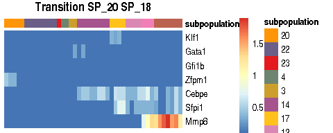

    ## GRN score for selected transitions
    tfs <- find_tfs(species = 'Mm')

    ## matching gene symbols and annotations

    transitions <- c('SP_20.SP_17','SP_20.SP_18','SP_20.SP_19', 'SP_20.SP_10')
    x <- grnscores(cellrouter, tfs, transitions, direction='up', q.up=14, dir.targets='up', columns=2, width=8, height=5, flip=FALSE, filename='results/lineage_regulators_score_up')

    ## [1] 0
    ## [1] 0
    ## [1] 0
    ## [1] 0

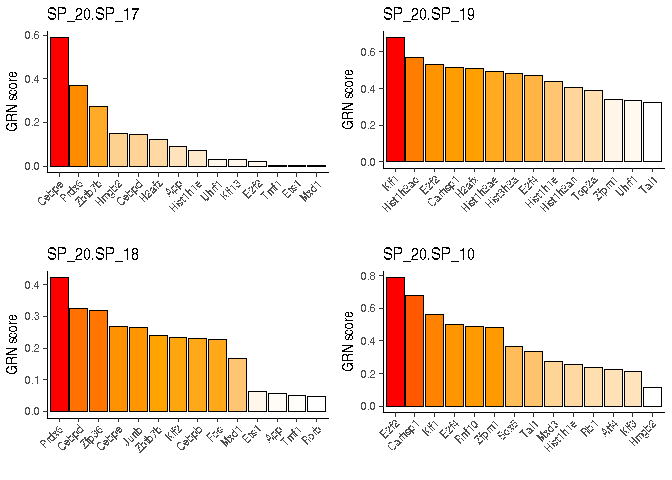

    p <- 'SP_20.SP_18'
    scores <- x[[p]]$scores
    m2 <- plottr(cellrouter, p, x[[p]]$scores, cluster=TRUE, 2, 2.5, 10, paste('results/', p, 'up_diff_dynamics.pdf',sep=''))

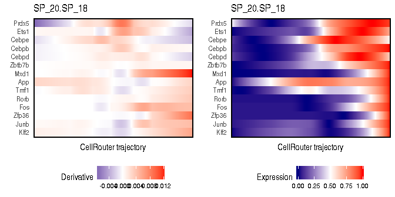

    paths <- c('SP_20.SP_18')
    plottrajectories(cellrouter, paths, names(scores)[1:5], rescale = TRUE, columns=1, width=5, height=2, filename='results/dynamics_curve.pdf')

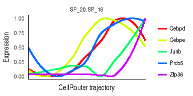

    plottrajectories(cellrouter, paths, c('Mmp8', 'Ngp', 'Elane', 'Retnlg'), rescale = TRUE, columns=1, width=5, height=2, filename='results/dynamics_markers.pdf')

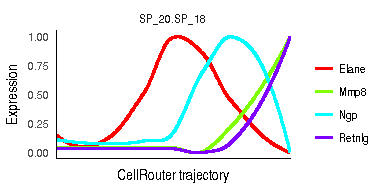

    plotDRExpression2(cellrouter, c('Mmp8', 'Ngp', 'Elane', 'Retnlg'), TRUE, 2, 6, 4, 'results/Neurophil_StemID.pdf')

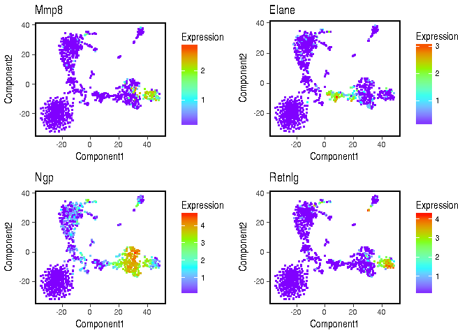

    plotbranch(cellrouter, 'up','SP_20.SP_10', 'SP_20.SP_18', 2, width=5, height=4, filename='results/SP_20.SP_10_branch_dynamics.pdf')

    plotbranch(cellrouter, 'up','SP_20.SP_18', 'SP_20.SP_10', 2, width=3, height=4, filename='results/SP_20.SP_18_branch_dynamics.pdf')

    ### Mxd1 targets
    plotDRExpression2(cellrouter, c('Mmp8', 'Mmp9', 'Cd52', 'Retnlg', 'Mxd1'), TRUE, 2, 6, 5, 'results/Mxd1_targets.pdf')

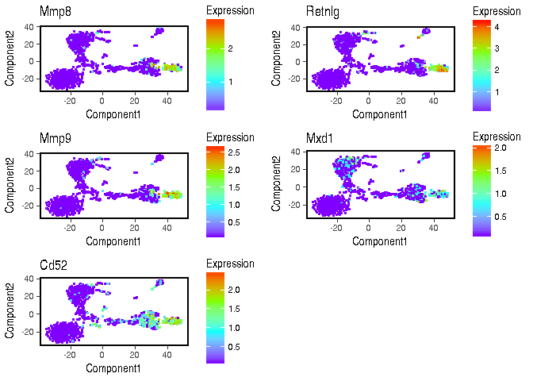

    ##Erythroblast branch (Klf1-high subpopulation)
    p <- 'SP_20.SP_10'
    m2 <- plottr(cellrouter, p, x[[p]]$scores, cluster=TRUE, 2, 2.5, 10, paste('results/', p, 'up_diff_dynamics.pdf',sep=''))

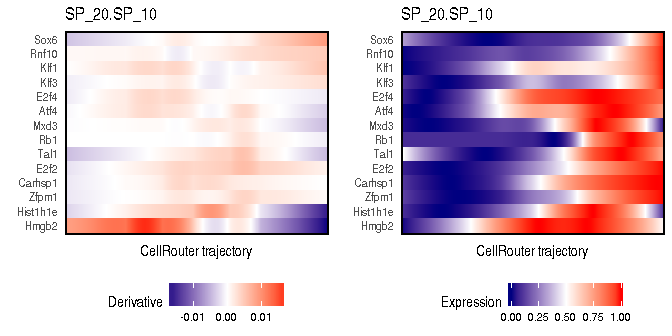

    genelist <- c('Klf1', 'Gata1', 'Gata2', 'Rnf10', 'Snca')
    plottrajectories(cellrouter, p, genelist, rescale = TRUE, columns=1, width=4, height=2, filename='results/dynamics_curve2.pdf')

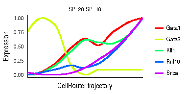

    #### Pathway enrichment analysis on selected trajectories
    #ids and cc are provided in the github webpage
    ids <- get(load('ids.R'))
    cc <- get(load('cell_cycle_genes_December_30_2015.R')) #cell cycle genes are removed
    paths <- c('SP_20.SP_10', 'SP_20.SP_19', 'SP_20.SP_17', 'SP_20.SP_18')
    cellrouter <- pathwayenrichment(cellrouter, paths, cc, 'mouse','org.Mm.eg.db', ids)

    ## removing genes...
    ## [1] "pathway enrichment for up-regulated genes"
    ## [1] "pathway enrichment for down-regulated genes"

    enr <- pathwaycluster(cellrouter, cellrouter@pathwayenrichment$UP$GOBP, 10, TRUE, 5, 5, 'results/Supplementary_Table_2_GO.pdf')

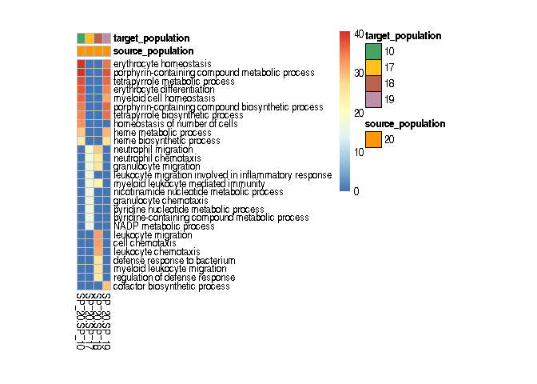
